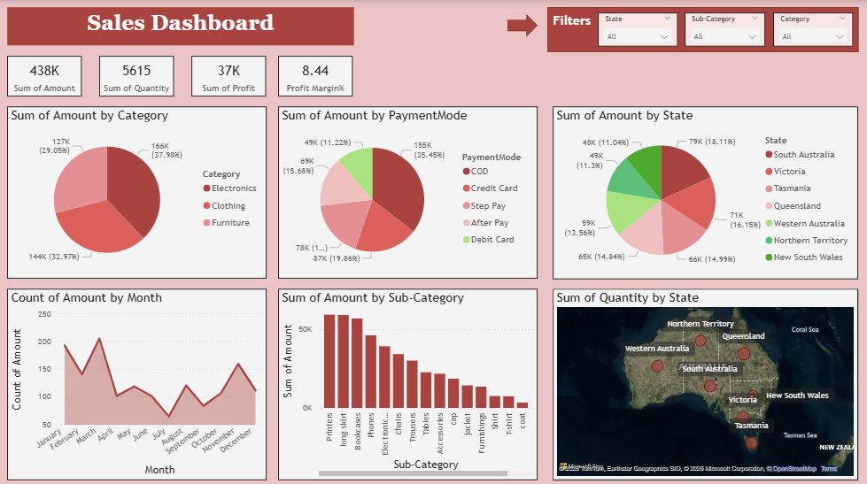

[sales_dashboard_readme.md](https://github.com/user-attachments/files/26560176/sales_dashboard_readme.md)
# Australia Sales Dashboard – Power BI



## Project Overview
An interactive Sales Dashboard built in Power BI as a personal side project to strengthen my data visualization and analytics skills. The dashboard provides a comprehensive view of sales performance across Australian states, product categories, and payment modes.

---

## Objective
To analyse sales trends, profit performance, and customer purchasing behaviour across different states, categories, and sub-categories in Australia using a sample retail dataset.

---

## Dataset
- **Source:** Kaggle (Sample Australia Sales Data)
- **Tables:**
  - `Details` — Order ID, Amount, Profit, Quantity, Category, Sub-Category, PaymentMode, Profit Margin%
  - `Orders_Australia` — Order ID, Order Date, CustomerName, State, City
- **Total Records:** 1,500 rows | 500 distinct orders

---

## Tools Used
| Tool | Purpose |
|---|---|
| Power BI Desktop | Dashboard development & visualisation |
| DAX | Custom measures & calculations |
| Power Query | Data transformation & cleaning |

---

## Dashboard Features

### Page 1 – Sales Overview
**KPI Cards:**
- Total Revenue = 438K
- Total Quantity Sold = 615
- Total Profit = 37K
- Profit Margin % = 8.44%

**Visuals:**
- Sales by Category (Electronics, Clothing, Furniture)
- Sales by Payment Mode (COD, Credit Card, Step Pay, After Pay, Debit Card)
- Sales by State (all Australian states)
- Count of Orders by Month (trend line)
- Sales by Sub-Category (bar chart)
- Quantity by State (map visual)

**Filters/Slicers:**
- State
- Category
- Sub-Category

---

### Page 2 – Profitability Analysis
**KPI Cards:**
- Total Orders = 500
- % Loss Making Orders = 49.60%
- Average Order Value = $875.54
- Loss Making Orders = 248

**Visuals:**
- Loss Making Orders by Sub-Category (bar chart) Long Skirt highest at 74 loss making orders
- Profit per Quantity by State (bar chart) Victoria leading at ~9.5

**Filters/Slicers:**
- Month
- Payment Mode
- State
- Category

---

## DAX Measures

```dax
-Total number of distinct orders
Total Orders = 
DISTINCTCOUNT(Details[Order ID])

-Average revenue per order
Average Order Value = 
DIVIDE(SUM(Details[Amount]), [Total Orders], 0)

-Count of orders where profit is negative
Loss Making Orders = 
CALCULATE(
    DISTINCTCOUNT(Details[Order ID]),
    Details[Profit] < 0
)

-Profit earned per unit sold
Profit per Quantity = 
DIVIDE(SUM(Details[Profit]), SUM(Details[Quantity]), 0)

-Percentage of orders that made a loss
% Loss Making Orders = 
DIVIDE([Loss Making Orders], [Total Orders], 0) * 100
```

---

## Key Insights
- Electronics is the top-selling category at 37.98% of total sales
- COD (Cash on Delivery) is the most preferred payment method at 35.45%
- New South Wales contributes the highest sales at 18.11%
- Printers and Long Skirts are the top-selling sub-categories
- 49.60% of all orders are loss making nearly half of all transactions are unprofitable
- Long Skirt has the highest loss making orders (74) despite being a top seller high volume but low profitability
- Victoria has the best profit per quantity at ~9.5, while South Australia is the least efficient at ~4

---

## Repository Structure
```
sales-dashboard-powerbi
 ┣ Sales Dashboard_Australia.pbix          Power BI file
 ┣ dashboard_preview.png         Page 1 - Sales Overview screenshot
 ┣ profitability_preview.png     Page 2 - Profitability Analysis screenshot
 ┣ README.md                     Project documentation
```

---

## How to Use
1. Clone or download this repository
2. Open `Sales Dashboard_Australia.pbix` in Power BI Desktop
3. Use the slicers to filter the data
4. Navigate between pages to explore different insights

---

## Author
**[Namita Samant]**
Data Analyst | Power BI | DAX | SQL
LinkedIn: [www.linkedin.com/in/namita-samant-2706b3129]
GitHub: [https://github.com/namitasamant6]
